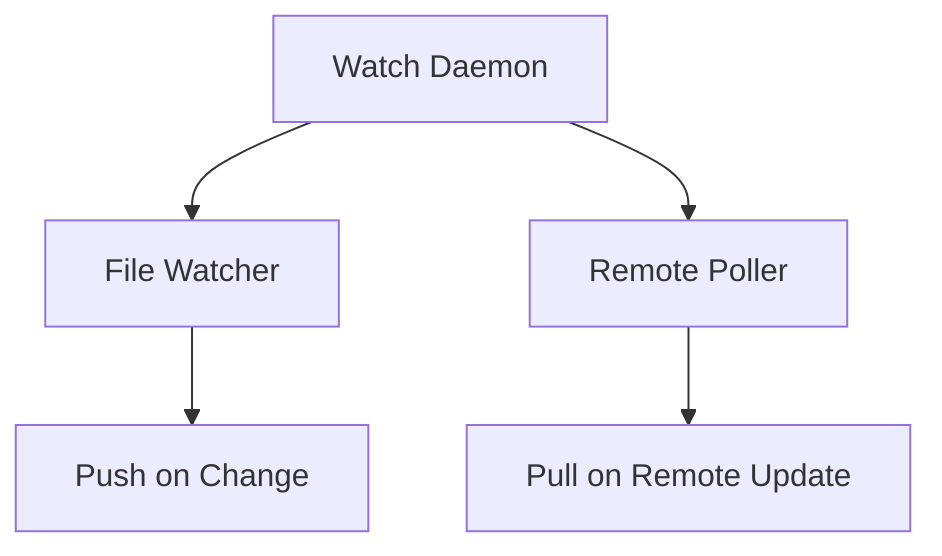

# /architecture-decision: アーキテクチャ決定ワークフロー

あなたはユーザーの `.issync/docs/plan-*.md` ファイルのアーキテクチャ決定フェーズをサポートしています。このコマンドは以下の9ステップのワークフローを自動化します：

1. 現在のStatusを検証
2. POC PR URLを受け取り、PR情報を取得
3. Discoveries & Insightsを参照
4. Decision Logを記入
5. Specification / 仕様セクションを記入
6. Acceptance Criteriaの妥当性検証
7. POC PRをクローズ
8. issync pushで同期（必要な場合）
9. GitHub Projects Status自動変更（architecture-decision → implement）

## コンテキスト

このコマンドは「矛盾解消駆動開発」ワークフローの**architecture-decisionステート**で使用されます：
- POC実装が完了し、PRが作成されている状態から開始
- POCで得た技術的知見（実現可能性、複雑性、制約）を基にアーキテクチャを決定
- Decision Log、Specification / 仕様、Acceptance Criteriaを記入
- POC PRをクローズし、人間の承認を待つ

## 前提条件

実行前に必要なものは以下です：
- [ ] **現在のGitHub Issue Statusが `architecture-decision` であることを確認**（手動確認）
- [ ] POC実装が完了し、PRが作成されている
- [ ] `GITHUB_TOKEN` 環境変数が設定されている（`export GITHUB_TOKEN=$(gh auth token)`）
- [ ] 進捗ドキュメントファイルがローカルに存在する

**重要**: このコマンドは`architecture-decision`ステートで実行されることを前提としています。適切なタイミングで実行する責任はユーザーにあります。

## 実行ステップ

### ステップ1: POC PR URLの受け取りとPR情報取得

#### 1.1 POC PR URLの受け取り

ユーザーにPOC PR URLを確認してください：

```
POC PR URLを教えてください（例: https://github.com/owner/repo/pull/123）
```

#### 1.2 PR情報の取得

POC PRから以下の情報を取得します：

```bash
# PR詳細を取得
gh pr view <PR URL> --json title,body,state,commits,comments

# PR diffを取得
gh pr diff <PR URL>
```

**収集する情報**:
- PR title
- PR description（body）
- State（open/closed）
- Commits（コミット一覧）
- Comments（レビューコメント、議論）
- Diff（変更内容）

**PRが既にクローズ済みの場合**:
- ⚠️ 警告を表示：「このPRは既にクローズされています。Decision Logの記入のみを実行します。」
- ステップ6（PRクローズ）をスキップして続行

---

### ステップ2: Discoveries & Insightsの参照

進捗ドキュメントの`Discoveries & Insights`セクションを読み、POC実装中に発見された技術的制約・複雑性を確認：

```markdown
## Discoveries & Insights

**YYYY-MM-DD: [発見のタイトル]**
- **発見**: [発見した技術的事実]
- **学び**: [この発見が実装にどう影響するか]
```

これらの発見事項とPR情報を統合し、アーキテクチャ決定の根拠とします。

---

### ステップ3: Decision Logの記入

POCの知見を基に、以下の形式でDecision Logセクションを記入します。

**既存のDecision Log内容は上書き**されます（このステップで確定したアーキテクチャ決定のみを記録）。

#### Decision Log記入フォーマット

```markdown
## Decision Log

### YYYY-MM-DD: [決定事項のタイトル]

- **採用**: [採用した技術・アーキテクチャ・アプローチ]
- **理由**: [POCの結果に基づく理由、技術的制約、実現可能性]
- **トレードオフ**: [採用しなかった選択肢とその理由]（オプション）

### YYYY-MM-DD: [決定事項のタイトル2]

...
```

**記入内容（状況に応じて必要なものを記載）**:
- **技術選定**: ライブラリ、フレームワーク、ツール
- **アーキテクチャパターン**: デザインパターン、システム構成
- **データモデル**: スキーマ、データ構造
- **API設計**: エンドポイント、インターフェース
- **テスト戦略**: テストレベル（単体/統合/E2E）、テストツール

**例**:
```markdown
### 2025-10-15: Watch daemonの実装方針

- **採用**: `chokidar`ライブラリによるファイル監視 + setIntervalによるポーリング
- **理由**: POCで検証した結果、chokidarは安定性が高く、クロスプラットフォーム対応が容易。GitHub API rate limitの制約から、ポーリング間隔は30秒が最適と判明。
- **トレードオフ**: Webhookベースのアプローチは設定の複雑さから初期実装では見送り。Phase 2で検討。
```

---

### ステップ4: Specification / 仕様セクションの記入

POCで検証したアーキテクチャを基に、以下の形式でSpecification / 仕様セクションを記入します。

**記入内容（状況に応じて必要なものを記載）**:
- **システム仕様**: 機能仕様、動作仕様
- **アーキテクチャ図**: mermaid図などで視覚化（オプション）
- **API設計**: インターフェース、エンドポイント
- **データモデル**: スキーマ、データ構造
- **設計方針**: 実装上の重要な考慮事項

#### Specification記入フォーマット

```markdown
## Specification / 仕様

### [サブシステム名・機能名]

**概要**: [機能の概要]

**仕様**:
- [仕様項目1]
- [仕様項目2]

**実装方針**:
- [実装上の考慮事項1]
- [実装上の考慮事項2]
```

**例（mermaid図を含む場合）**:
```markdown
## Specification / 仕様

### Watch Daemon アーキテクチャ

**概要**: ファイル変更の監視とGitHub Issue commentへの自動同期

**アーキテクチャ図**:


**仕様**:
- ファイル変更検知: chokidarによるリアルタイム監視
- リモート変更検知: 30秒間隔でGitHub API polling
- 同期方向: 双方向（local → remote, remote → local）

**実装方針**:
- Daemon processとして実行、PIDを.issync/state.ymlに記録
- Graceful shutdown（SIGTERM/SIGINT）に対応
- エラーリトライ: 3回まで、指数バックオフ
```

---

### ステップ5: Acceptance Criteriaの妥当性検証

POCの結果を踏まえて、既存のAcceptance Criteriaが実現可能かを検証し、必要に応じて調整します。

#### 検証プロセス

1. 現在のAcceptance Criteriaを読む
2. POCで判明した技術的制約を確認
3. 実現不可能な項目、または過度に野心的な項目があれば調整

#### 調整が必要な場合の例

**調整前**:
```markdown
**受け入れ基準:**
- watch daemonがリアルタイムで変更を同期する（1秒以内）
```

**POC結果**: GitHub API rate limitの制約から、1秒間隔のポーリングは不可能と判明

**調整後**:
```markdown
**受け入れ基準:**
- watch daemonが30秒間隔で変更を同期する（GitHub API rate limit内）
- ローカル変更はリアルタイム検知、即座にpush
```

#### 調整不要な場合

Acceptance Criteriaが妥当であると判断した場合、変更は不要です。その旨を記録：

```markdown
**POC検証結果**: 全ての受け入れ基準がPOCで実現可能性を確認済み。変更不要。
```

---

### ステップ6: POC PRのクローズ

POC PRをクローズします：

```bash
gh pr close <PR URL> --comment "POC完了。アーキテクチャ決定を進捗ドキュメントに記録しました。implementフェーズに進みます。"
```

**PRが既にクローズ済みの場合**:
- このステップをスキップ（ステップ2で検知済み）

---

### ステップ7: issync pushで同期

**注意**: issyncのwatchモードが起動している場合は、ファイルの変更が自動的にGitHub Issueに同期されます。明示的なpushコマンドは不要です。

#### watchモードの確認

```bash
# watchが起動しているか確認
ps aux | grep "issync watch" | grep -v grep
```

#### watchが起動していない場合

```bash
issync push
```

---

### ステップ8: GitHub Projects Status自動変更

architecture-decision完了後、Statusを自動的に`implement`に変更します。

**実行手順**:
1. Issue URLからowner/repo/issue_numberを抽出
2. GraphQL APIでProject IDを取得（タイトルに"Workflow"を含むProject）
3. `gh project field-list`でField IDとimplement Option IDを取得
4. `gh project item-list`でItem IDを取得
5. `gh project item-edit`でStatus変更

**エラーハンドリング**:
- **認証スコープ不足**: `gh auth refresh -s project --hostname github.com` を実行後、再度 /architecture-decision 実行
- **ID取得失敗**: GitHub Projects UIで手動変更
- **Status変更失敗**: エラー詳細と手動変更用のghコマンドを表示

**成功時の出力**:
```
✓ GitHub Projects Statusを `implement` に変更しました
  Project: <project_title> (#<project_number>)
  Issue: #<issue_number>
```

---

## 出力フォーマット

全ステップ完了後、以下の形式でサマリーを提供：

```markdown
## /architecture-decision 実行結果

### 完了したステップ
- ✅ ステップ1: POC PR情報取得（PR #123: [PR Title]）
- ✅ ステップ2: Discoveries & Insights参照（[X]項目を確認）
- ✅ ステップ3: Decision Log記入（[Y]個の決定事項を記録）
- ✅ ステップ4: Specification / 仕様記入
- ✅ ステップ5: Acceptance Criteria検証（調整: [あり/なし]）
- ✅ ステップ6: POC PRクローズ（PR #123）
- ✅ ステップ7: issync push完了（watchモードで自動同期）
- ✅ ステップ8: GitHub Projects Status変更（architecture-decision → implement）

### 記録された決定事項
1. [決定事項1のタイトル]
2. [決定事項2のタイトル]
...

### GitHub Projects Status変更
- Status: `architecture-decision` → `implement` ✅
- Project: {project_title} (#{project_number})

### 次のアクション
- [ ] 進捗ドキュメントの内容（Decision Log、Specification、Acceptance Criteria）をレビューしてください
- [ ] アーキテクチャ決定が適切か確認してください
- [ ] implementのチェックリストを確認し、本実装を開始してください
```

---

## 重要な注意事項

### Decision Logの記入について

- **POCの結果を具体的に記述**してください: 「検証した結果、実現可能と判明」ではなく、「chokidarでファイル監視を実装し、30秒間隔のポーリングで安定動作を確認」のように具体的に
- **採用しなかった選択肢も記録**してください（トレードオフ）: 将来の意思決定の参考になります

### Specification / 仕様の記入について

- **実装者が迷わないレベルの詳細度**を目指してください
- **mermaid図を活用**してください: アーキテクチャは視覚化すると理解しやすい
- **状況に応じて必要な内容のみ記載**してください: 全ての項目を記載する必要はありません

### Acceptance Criteriaの調整について

- **POCで判明した制約を反映**してください
- **過度な削減は避ける**: 実現可能性を確保しつつ、タスクの価値は維持してください

### PRクローズについて

- **PRが既にクローズされている場合でも続行**してください（Decision Logの記入は実行）
- **PRクローズ時のコメント**は、次のステップを明記してください

### エラーハンドリング

| ケース | 対応 |
|--------|------|
| POC PR URLが無効 | ❌ エラー終了（"無効なPR URLです"） |
| POC PRが既にクローズ済み | ⚠️ 警告を出して続行（Decision Log記入のみ実行） |
| POCの知見が不足（Discoveries & Insightsが空） | ⚠️ 警告を出して続行（最小限の記入を実施） |

**注意**:
- このコマンドに渡されたPRは全てPoC PRとして扱います（PoC PR判定ロジックは不要）
- このコマンドは`architecture-decision`ステートで実行されることを前提としています（Status検証は不要、ユーザーの責任で適切なタイミングで実行）

---

## 実行例

**ユーザー:** `/architecture-decision https://github.com/owner/repo/pull/456`

**アシスタント:**

### ステップ1: POC PR情報取得

PR #456の情報を取得します...

**PR情報**:
- Title: "POC: Watch daemon implementation"
- State: open
- Commits: 5個のコミット
- Comments: 2個のレビューコメント

[PR diffを取得し、主要な変更点を確認]

---

### ステップ2: Discoveries & Insights参照

進捗ドキュメントのDiscoveries & Insightsを確認します...

**確認した発見事項**:
1. chokidarライブラリによるファイル監視の安定性
2. GitHub API rate limitの制約（5000 req/hour）
3. ポーリング間隔は30秒が最適

---

### ステップ3: Decision Log記入

POCの知見を基に、Decision Logを記入します...

**記録した決定事項**:
1. Watch daemonの実装方針（chokidar + setInterval）
2. ポーリング間隔の設定（30秒）
3. エラーハンドリング戦略（3回リトライ + 指数バックオフ）

---

### ステップ4: Specification / 仕様記入

アーキテクチャ仕様を記入します...

**記入内容**:
- Watch Daemon アーキテクチャ（mermaid図を含む）
- ファイル監視仕様
- リモート同期仕様

---

### ステップ5: Acceptance Criteria検証

既存のAcceptance Criteriaを検証します...

**検証結果**: ポーリング間隔を「1秒以内」から「30秒間隔」に調整しました（GitHub API rate limit制約のため）

---

### ステップ6: POC PRクローズ

PR #456をクローズします...

✅ PRクローズ完了（コメント付き）

---

### ステップ7: issync同期

watchモードが起動しているため、自動的にGitHub Issueに同期されます。

---

### ステップ8: GitHub Projects Status変更

Issue #17のStatusを`implement`に変更します...

✅ GitHub Projects Statusを `implement` に変更しました
  Project: Liam Workflow Board(PoC) (#201)
  Issue: #17

---

## /architecture-decision 実行結果

### 完了したステップ
- ✅ ステップ1: POC PR情報取得（PR #456: "POC: Watch daemon implementation"）
- ✅ ステップ2: Discoveries & Insights参照（3項目を確認）
- ✅ ステップ3: Decision Log記入（3個の決定事項を記録）
- ✅ ステップ4: Specification / 仕様記入
- ✅ ステップ5: Acceptance Criteria検証（調整: あり - ポーリング間隔を30秒に変更）
- ✅ ステップ6: POC PRクローズ（PR #456）
- ✅ ステップ7: issync push完了（watchモードで自動同期）
- ✅ ステップ8: GitHub Projects Status変更（architecture-decision → implement）

### 記録された決定事項
1. Watch daemonの実装方針（chokidar + setInterval）
2. ポーリング間隔の設定（30秒）
3. エラーハンドリング戦略（3回リトライ + 指数バックオフ）

### GitHub Projects Status変更
- Status: `architecture-decision` → `implement` ✅
- Project: Liam Workflow Board(PoC) (#201)

### 次のアクション
- [ ] 進捗ドキュメントの内容（Decision Log、Specification、Acceptance Criteria）をレビューしてください
- [ ] アーキテクチャ決定が適切か確認してください
- [ ] implementのチェックリストを確認し、本実装を開始してください

---

## 補足: ステートマシンとの統合

このコマンド実行後の流れ：

```
pocステート完了
   ↓
POC実装 & PR作成
   ↓
Statusを architecture-decision に変更
   ↓
/architecture-decision コマンド実行 (このコマンド)
   ├─ Status検証
   ├─ POC PR情報取得
   ├─ Discoveries & Insights参照
   ├─ Decision Log記入
   ├─ Specification記入
   ├─ Acceptance Criteria検証
   ├─ POC PRクローズ
   ├─ issync push（自動同期）
   └─ Status自動変更（architecture-decision → implement）
   ↓
アーキテクチャ決定完了
   ↓
人間が進捗ドキュメントをレビュー
   ↓
承認後、本実装開始
```

**重要**: アーキテクチャ決定完了後、必ず人間が進捗ドキュメントの内容（Decision Log、Specification、Acceptance Criteria）をレビューし、承認してから本実装を開始してください。Statusは自動的に`implement`に変更されます。
