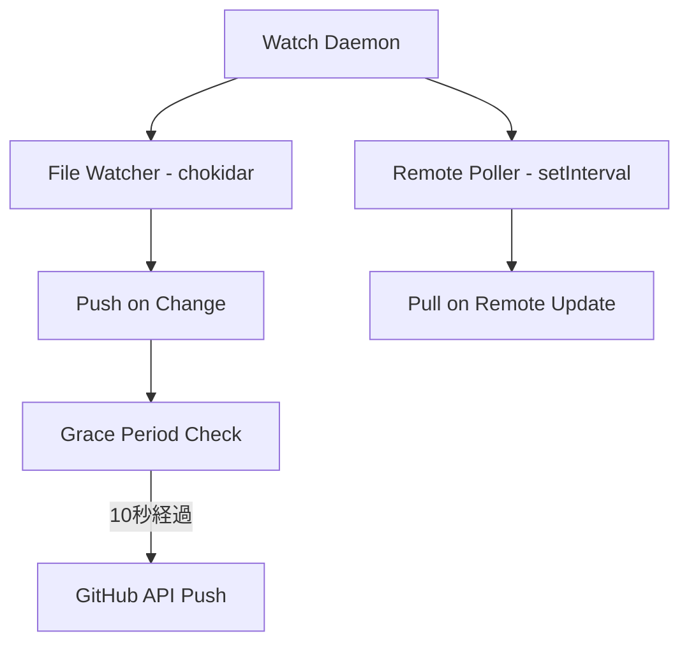

# /issync:review-poc: POCレビューワークフロー

あなたはユーザーの `.issync/docs/plan-*.md` ファイルのPOCレビューフェーズをサポートしています。このコマンドは以下の11ステップのワークフローを自動化します：

1. Stage設定（In Progress）
2. POC PR URLを受け取り、PR情報を取得
3. Discoveries & Insightsを参照
4. **Acceptance Criteriaの検証（達成/未達成を明確化）**
5. **Discoveries & Insightsへの追記**
6. **Open Questionsへの論点追加（強化）**
7. **Decision Log推奨案の記入（人間の最終決定を前提）**
8. Specification / 仕様の記入（オプショナル）
9. POC PRをクローズ
10. issync pushで同期（必要な場合）
11. Stage更新（To Review）

**重要**: このコマンドは**人間の意思決定のための材料を提供する**ことが目的です。最終的なアーキテクチャ決定は人間が行います。

## コンテキスト

このコマンドは「矛盾解消駆動開発」ワークフローの**architecture-decisionステート**で使用されます：
- POC実装が完了し、PRが作成されている状態から開始
- POCで得た技術的知見（実現可能性、複雑性、制約）を分析
- Acceptance Criteriaの達成状況を確認
- 未達成項目の理由を分析し、Open Questionsに論点を追加
- Decision Log推奨案を記入（最終決定は人間が行う）
- 人間がレビュー・承認後、手動でStatusを`implement`に変更

## 前提条件

実行前に必要なものは以下です：
- [ ] **現在のGitHub Issue Statusが `architecture-decision` であることを確認**（手動確認）
- [ ] POC実装が完了し、PRが作成されている
- [ ] `ISSYNC_GITHUB_TOKEN` 環境変数が設定されている
- [ ] 進捗ドキュメントファイルがローカルに存在する

**重要**: このコマンドは`architecture-decision`ステートで実行されることを前提としています。適切なタイミングで実行する責任はユーザーにあります。

## 実行ステップ

### ステップ1: Stage設定（AI作業開始）

`!env ISSYNC_GITHUB_PROJECTS_NUMBER`が設定されている場合のみ、`gh project item-edit`でStage→`In Progress`に設定。失敗時も作業継続（警告のみ）。

環境変数:
- `ISSYNC_GITHUB_PROJECTS_NUMBER`: プロジェクト番号（例: `1`）
- `ISSYNC_GITHUB_PROJECTS_OWNER_TYPE`: `user` または `org`（デフォルト: `user`）

**Stage 設定コマンド**:

```bash
# GitHub Projects ヘルパースクリプトを使用
bash ${CLAUDE_PLUGIN_ROOT}/scripts/github-projects.sh set-stage $ISSUE_NUMBER "in progress"
```

---

### ステップ2: POC PR URLの受け取りとPR情報取得

#### 2.1 POC PR URLの受け取り

ユーザーにPOC PR URLを確認してください：

```
POC PR URLを教えてください（例: https://github.com/owner/repo/pull/123）
```

#### 2.2 PR情報の取得

POC PRから以下の情報を取得します：

```bash
# PR詳細を取得
gh pr view <PR URL> --json title,body,state,commits,comments

# PR diffを取得
gh pr diff <PR URL>
```

**収集する情報**:
- PR title
- PR description（body）
- State（open/closed）
- Commits（コミット一覧）
- Comments（レビューコメント、議論）
- Diff（変更内容）

**PRが既にクローズ済みの場合**:
- ⚠️ 警告を表示：「このPRは既にクローズされています。レビュー情報の記入のみを実行します。」
- ステップ8（PRクローズ）をスキップして続行

#### 2.3 PRに対応するissueの特定

1. **PR本文の解析**
   - 本文中のissue言及を理解（"Resolves:", "Fixes #123", "Part of #456" など、自然言語として柔軟に解釈）
   - 完全URL形式（`https://github.com/.../issues/番号`）を優先、`#番号`はPRと同一リポジトリと判断

2. **複数/未検出時の処理**
   - 複数issue: ユーザーに選択させる
   - 未検出: issue URLまたは番号の入力を促す

3. **使用**
   - 進捗ドキュメント検索: `.issync/docs/plan-{issue番号}-*.md`
   - GitHub Projects操作（Stage更新）

---

### ステップ3: Discoveries & Insightsの参照

進捗ドキュメントの`Discoveries & Insights`セクションを読み、POC実装中に発見された技術的制約・複雑性を確認：

```markdown
## Discoveries & Insights

**YYYY-MM-DD: [発見のタイトル]**
- **発見**: [発見した技術的事実]
- **学び**: [この発見が実装にどう影響するか]
```

これらの発見事項とPR情報を統合し、Acceptance Criteria検証の根拠とします。

---

### ステップ4: Acceptance Criteriaの検証（大幅強化）

**目的**: POCがAcceptance Criteriaを満たしているかを詳細に検証し、未達成項目の理由を明確化する。

#### 検証プロセス

1. 現在のAcceptance Criteriaを読む
2. POC PR diffとコミット、Discoveries & Insightsを参照
3. 各項目について達成/未達成を判定
4. 未達成の場合、その理由を分析（技術的制約? 優先度? スコープ外?）

#### 検証結果の記入フォーマット

進捗ドキュメントに新しいセクション「POC検証結果」を追加します：

```markdown
## POC検証結果

### Acceptance Criteria達成状況

**達成した項目:**
- ✅ [受け入れ基準1]
  - 検証方法: [どのように確認したか]
  - PR参照: [関連するコミットやdiff]

- ✅ [受け入れ基準2]
  - 検証方法: [どのように確認したか]
  - PR参照: [関連するコミットやdiff]

**未達成の項目:**
- ❌ [受け入れ基準3]
  - 理由: [なぜ達成できなかったか - 技術的制約、実現不可能性、優先度など]
  - 影響: [この未達成が本実装にどう影響するか]
  - 対応方針: [Open Questionに追加 / Acceptance Criteria調整 / Phase 2に延期 など]

**スコープ外と判断した項目:**
- ⚠️ [受け入れ基準4]
  - 理由: [なぜスコープ外と判断したか]
  - 将来の対応: [Phase 2で検討 / 別Issueで対応 など]
```

#### 例

```markdown
## POC検証結果

### Acceptance Criteria達成状況

**達成した項目:**
- ✅ watch daemonがファイル変更を検知できる
  - 検証方法: chokidarによるファイル監視を実装、ローカルファイル変更時に自動pushを確認
  - PR参照: コミット abc123 "Add chokidar file watcher"

- ✅ リモートポーリングが動作する
  - 検証方法: setIntervalで30秒間隔のポーリングを実装、remote変更時に自動pullを確認
  - PR参照: コミット def456 "Add remote polling with setInterval"

**未達成の項目:**
- ❌ 1秒以内の同期を実現する
  - 理由: GitHub API rate limit制約（5000 req/hour = 最短7.2秒間隔）により、1秒間隔のポーリングは不可能
  - 影響: 同期遅延が発生する（現在のPOCでは30秒間隔）
  - 対応方針: Open Questionに「最適なポーリング間隔」を追加し、人間が判断

**スコープ外と判断した項目:**
- ⚠️ Webhook対応
  - 理由: GitHub Webhook設定の複雑さ（ngrok等の外部ツール必要）、Phase 1では優先度低
  - 将来の対応: Phase 2で検討（より迅速な同期が必要と判明した場合）
```

#### 未達成項目への対応

未達成項目が簡単に解消できない場合、**必ずOpen Questionsに論点を追加**してください（ステップ5）。

---

### ステップ5: Discoveries & Insightsへの追記

POC実装で新たに発見した技術的事実を追記します。

**追記内容（状況に応じて必要なものを記載）**:
- 技術的制約（API rate limit、パフォーマンス特性など）
- 実現可能性の確認（「できる」「できない」の明確化）
- エッジケース、想定外の動作
- ライブラリ・ツールの特性
- 複雑性の見積もり

#### 追記フォーマット

```markdown
## Discoveries & Insights

**YYYY-MM-DD: [発見のタイトル]**
- **発見**: [発見した技術的事実]
- **学び**: [この発見が実装にどう影響するか]
- **POC参照**: [関連するコミットやPR]
```

#### 例

```markdown
## Discoveries & Insights

**2025-10-15: GitHub API rate limitの実測値**
- **発見**: GitHub API rate limitは5000 req/hourであり、1秒間隔のポーリングは不可能（最短7.2秒間隔）
- **学び**: Acceptance Criteriaの「1秒以内の同期」は技術的に実現不可能。ポーリング間隔を調整する必要がある
- **POC参照**: コミット abc123 "Test rate limit with 1s polling"

**2025-10-15: chokidarの安定性**
- **発見**: chokidarはクロスプラットフォームで安定動作し、ファイル変更を確実に検知できる
- **学び**: ローカルファイル監視にはchokidarが適している
- **POC参照**: コミット def456 "Add chokidar file watcher"

**2025-10-15: Pull→Pushループのリスク**
- **発見**: Remote pullでファイル更新→chokidarが検知→pushが発生する無限ループが発生
- **学び**: Grace period（猶予期間）を設けることで回避可能。pullから10秒間はpushを抑制する実装が必要
- **POC参照**: コミット ghi789 "Add grace period to prevent pull→push loop"
```

---

### ステップ6: Open Questionsへの論点追加（大幅強化）

**目的**: 未達成のAcceptance Criteriaや技術的な選択肢について、人間が意思決定するための論点を明確化する。

#### 論点追加のガイドライン

以下のような場合に論点を追加します：
- ❌ Acceptance Criteriaが未達成（簡単に解消できない）
- 🤔 技術的な選択肢が複数ある（Option A vs B）
- ⚖️ トレードオフがある（パフォーマンス vs 複雑さ）
- 🔍 不確実性がある（スケーラビリティ、ユーザー体験など）

#### 論点記入フォーマット

```markdown
## Open Questions

### Q[番号]: [質問のタイトル]

**背景**: [なぜこの質問が生まれたか - POCで判明した事実]

**選択肢:**
- Option A: [選択肢1]
  - メリット: [利点]
  - デメリット: [欠点]
  - 実装難易度: [高/中/低]

- Option B: [選択肢2]
  - メリット: [利点]
  - デメリット: [欠点]
  - 実装難易度: [高/中/低]

**推奨**: [AIの推奨案（あれば）と根拠]

**決定者**: [人間が決定] / **決定期限**: [必要であれば]
```

#### 例

```markdown
## Open Questions

### Q1: GitHub API rate limitを考慮した最適なポーリング間隔は？

**背景**: POCで1秒間隔のポーリングは不可能と判明（rate limit: 5000 req/hour = 最短7.2秒間隔）

**選択肢:**
- Option A: 30秒間隔（120 req/hour）
  - メリット: 安全マージン大（rate limitの2.4%のみ使用）、複数プロジェクト同時watchでも余裕あり
  - デメリット: 同期遅延が最大30秒発生、ユーザー体験がやや悪い
  - 実装難易度: 低（POCで既に実装済み）

- Option B: 10秒間隔（360 req/hour）
  - メリット: より迅速な同期（最大10秒遅延）、ユーザー体験向上
  - デメリット: rate limitの7.2%使用、複数プロジェクトで制約あり
  - 実装難易度: 低（setIntervalの値変更のみ）

- Option C: 設定可能にする（デフォルト30秒）
  - メリット: ユーザーが自分の環境に合わせて調整可能
  - デメリット: 設定の複雑さ増加、rate limit超過のリスク
  - 実装難易度: 中（state.ymlにpoll_interval追加）

**推奨**: Option C（設定可能、デフォルト30秒）
- 理由: ユーザーによって同時watch数が異なるため、柔軟性が重要
- rate limit超過時のエラーハンドリングを実装すれば安全

**決定者**: [人間が決定]

---

### Q2: Pull→Pushループ防止のgrace periodは何秒が適切か？

**背景**: POCでgrace period 10秒を実装したが、最適値は未検証

**選択肢:**
- Option A: 5秒
  - メリット: ローカル変更への反応が早い
  - デメリット: pullが遅い場合にループのリスク

- Option B: 10秒（POC実装値）
  - メリット: 安全性高い
  - デメリット: ローカル変更後の同期が最大10秒遅延

- Option C: ポーリング間隔 × 1.5倍（動的調整）
  - メリット: ポーリング間隔に応じて最適化
  - デメリット: 実装がやや複雑

**推奨**: Option B（10秒固定）
- 理由: シンプルで安全、Phase 1では十分

**決定者**: [人間が決定]
```

---

### ステップ7: Decision Log推奨案の記入

**重要**: このステップで記入するのは**推奨案**であり、**最終決定ではありません**。人間がレビュー・承認してから確定します。

POCの知見を基に、以下の形式でDecision Log推奨案を記入します。

#### Decision Log推奨案フォーマット

```markdown
## Decision Log

> **注**: 以下は `/review-poc` による推奨案です。最終決定は人間が行ってください。
>
> **承認プロセス**: 各推奨案をレビューし、承認/修正/却下を決定してください。

### 推奨案 YYYY-MM-DD: [決定事項のタイトル]

- **推奨技術/アプローチ**: [推奨する技術・アーキテクチャ・アプローチ]
- **根拠**: [POCの結果に基づく理由、技術的制約、実現可能性]
- **トレードオフ**: [採用しなかった選択肢とその理由]（オプション）
- **最終決定**: [ ] 承認待ち / [ ] 承認済み / [ ] 却下

---

### 推奨案 YYYY-MM-DD: [決定事項のタイトル2]

...
```

#### 記入内容（状況に応じて必要なものを記載）

- **技術選定**: ライブラリ、フレームワーク、ツール
- **アーキテクチャパターン**: デザインパターン、システム構成
- **データモデル**: スキーマ、データ構造
- **API設計**: エンドポイント、インターフェース
- **テスト戦略**: テストレベル（単体/統合/E2E）、テストツール

#### 例

```markdown
## Decision Log

> **注**: 以下は `/review-poc` による推奨案です。最終決定は人間が行ってください。
>
> **承認プロセス**: 各推奨案をレビューし、承認/修正/却下を決定してください。

### 推奨案 2025-10-15: Watch daemonの実装方針

- **推奨技術**: `chokidar`ライブラリによるファイル監視 + `setInterval`によるリモートポーリング
- **根拠**: POCで検証した結果、chokidarは安定性が高く、クロスプラットフォーム対応が容易。setIntervalによるポーリングはシンプルで理解しやすい
- **トレードオフ**: Webhookベースのアプローチは設定の複雑さ（ngrok等の外部ツール必要）から初期実装では見送りを推奨。Phase 2で検討
- **最終決定**: [ ] 承認待ち

---

### 推奨案 2025-10-15: ポーリング間隔

- **推奨設定**: 設定可能にする（デフォルト30秒）
- **根拠**: GitHub API rate limit制約から、30秒間隔が安全。ユーザーによって同時watch数が異なるため、柔軟性が重要
- **トレードオフ**: 固定値（30秒）の方がシンプルだが、ユーザーのニーズに対応できない
- **最終決定**: [ ] 承認待ち（Open Question Q1で議論中）

---

### 推奨案 2025-10-15: Pull→Pushループ防止策

- **推奨実装**: Grace period 10秒（pullから10秒間はpushを抑制）
- **根拠**: POCで動作確認済み、シンプルで安全
- **トレードオフ**: 動的調整（ポーリング間隔 × 1.5倍）の方が柔軟だが、実装が複雑
- **最終決定**: [ ] 承認待ち
```

---

### ステップ8: Specification / 仕様の記入（オプショナル）

**重要**: このステップは**POCで明確になった部分のみ**記入してください。不確実な部分は記入しません。

POCで検証したアーキテクチャを基に、以下の形式でSpecification / 仕様セクションを記入します。

#### 記入内容（状況に応じて必要なものを記載）

- **システム仕様**: 機能仕様、動作仕様（POCで確認済みのもののみ）
- **アーキテクチャ図**: mermaid図などで視覚化（オプション）
- **API設計**: インターフェース、エンドポイント
- **データモデル**: スキーマ、データ構造
- **設計方針**: 実装上の重要な考慮事項

#### Specification記入フォーマット

```markdown
## Specification / 仕様

> **注**: 以下はPOCで確認された仕様です。不確実な部分は記載していません。

### [サブシステム名・機能名]

**概要**: [機能の概要]

**仕様**:
- [仕様項目1]（POCで確認済み）
- [仕様項目2]（POCで確認済み）

**実装方針**:
- [実装上の考慮事項1]
- [実装上の考慮事項2]
```

#### 例（mermaid図を含む場合）

```markdown
## Specification / 仕様

> **注**: 以下はPOCで確認された仕様です。不確実な部分は記載していません。

### Watch Daemon アーキテクチャ

**概要**: ファイル変更の監視とGitHub Issue commentへの自動同期（POCで実装確認済み）

**アーキテクチャ図**:


**仕様**:
- ファイル変更検知: chokidarによるリアルタイム監視（POCで動作確認）
- リモート変更検知: 30秒間隔でGitHub API polling（設定可能、デフォルト30秒）
- 同期方向: 双方向（local → remote, remote → local）
- Grace period: pullから10秒間はpushを抑制（ループ防止）

**実装方針**:
- Daemon processとして実行、PIDを.issync/state.ymlに記録
- Graceful shutdown（SIGTERM/SIGINT）に対応
- エラーリトライ: 3回まで、指数バックオフ（POCでは未実装、本実装で追加）
```

**記入しない例**:
- POCで検証していない機能（エラーリトライの詳細など）
- 不確実な仕様（「将来的にWebhook対応する可能性」など）

---

### ステップ9: POC PRのクローズ

POC PRをクローズします：

```bash
gh pr close <PR URL> --comment "POC完了。レビュー結果を進捗ドキュメントに記録しました。人間がレビュー・承認後、implementフェーズに進みます。"
```

**PRが既にクローズ済みの場合**:
- このステップをスキップ（ステップ1で検知済み）

---

### ステップ10: GitHub Issueへの同期

進捗ドキュメントの変更をGitHub Issueに同期します。

```bash
issync push
```

---

### ステップ11: Stage更新（レビュー待ち）

`!env ISSYNC_GITHUB_PROJECTS_NUMBER`が設定されている場合のみ、`gh project item-edit`でStage→`To Review`に設定。失敗時も作業継続（警告のみ）。

**Stage 設定コマンド**:

```bash
# GitHub Projects ヘルパースクリプトを使用
bash ${CLAUDE_PLUGIN_ROOT}/scripts/github-projects.sh set-stage $ISSUE_NUMBER "to review"
```

**重要**: 人間承認後、Status→`implement`、Stage→`To Start`を手動で変更。

---

## 出力フォーマット

全ステップ完了後、以下の形式でサマリーを提供：

```markdown
## /issync:review-poc 実行結果

### 完了したステップ
- ✅ ステップ1: POC PR情報取得（PR #123: [PR Title]）
- ✅ ステップ2: Discoveries & Insights参照（[X]項目を確認）
- ✅ ステップ3: Acceptance Criteria検証（達成: [Y]項目、未達成: [Z]項目）
- ✅ ステップ4: Discoveries & Insights追記（[W]個の発見を追加）
- ✅ ステップ5: Open Questions追加（[V]個の論点を追加）
- ✅ ステップ6: Decision Log推奨案記入（[U]個の推奨案を記録）
- ✅ ステップ7: Specification / 仕様記入（オプショナル）
- ✅ ステップ8: POC PRクローズ（PR #123）
- ✅ ステップ9: GitHub Issueへの同期完了（issync push）

### Acceptance Criteria検証結果
- ✅ 達成: [達成した項目のリスト]
- ❌ 未達成: [未達成の項目のリスト]
- ⚠️ スコープ外: [スコープ外と判断した項目のリスト]

### 追加されたOpen Questions
1. Q[番号]: [質問のタイトル]
2. Q[番号]: [質問のタイトル]
...

### Decision Log推奨案
1. [推奨案1のタイトル] - [ ] 承認待ち
2. [推奨案2のタイトル] - [ ] 承認待ち
...

### 次のアクション（重要）
- [ ] **進捗ドキュメントの内容（POC検証結果、Open Questions、Decision Log推奨案）をレビューしてください**
- [ ] **Open Questionsを検討し、意思決定を行ってください**
- [ ] **Decision Log推奨案を承認/修正/却下してください**
- [ ] **承認後、GitHub Projects Statusを手動で`implement`に変更してください**
- [ ] **implementのチェックリストを確認し、本実装を開始してください**
```

---

## 重要な注意事項

### Acceptance Criteria検証について

- **全ての項目を明確に分類**してください: 達成/未達成/スコープ外
- **未達成の理由を具体的に記述**してください: 「実現できなかった」ではなく、「GitHub API rate limit制約により1秒間隔は不可能」のように
- **簡単に解消できない未達成項目は必ずOpen Questionに追加**してください

### Discoveries & Insights追記について

- **POCで新たに発見した事実のみ記述**してください
- **「できる」「できない」を明確化**してください: 曖昧な表現を避ける
- **POC参照（コミットハッシュ、PR diff）を必ず記載**してください

### Open Questions追加について

- **選択肢を具体的に記述**してください: メリット・デメリット・実装難易度を明示
- **AIの推奨案は提示するが、最終決定は人間に委ねる**ことを明記
- **複数の論点がある場合、優先度を示す**ことも有用（オプション）

### Decision Log推奨案について

- **「推奨案」であることを明記**してください: 「最終決定は人間が行う」を必ず記載
- **承認チェックボックス `[ ] 承認待ち` を必ず含める**
- **POCの結果を具体的に記述**してください: 「検証した結果、実現可能と判明」ではなく、「chokidarでファイル監視を実装し、30秒間隔のポーリングで安定動作を確認」のように

### Specification / 仕様について

- **POCで確認された部分のみ記載**してください: 不確実な部分は記載しない
- **mermaid図を活用**してください: アーキテクチャは視覚化すると理解しやすい
- **このステップはオプショナル**です: 仕様が明確でない場合はスキップしても構いません

### PRクローズについて

- **PRが既にクローズされている場合でも続行**してください（レビュー情報の記入は実行）
- **PRクローズ時のコメント**は、次のステップ（人間のレビュー）を明記してください

### 人間のレビュープロセス

このコマンド完了後、**必ず人間が以下をレビュー・承認してください**：

1. **POC検証結果**: Acceptance Criteria達成状況は正確か？
2. **Open Questions**: 論点は明確か？選択肢は網羅されているか？
3. **Decision Log推奨案**: 推奨案は合理的か？承認/修正/却下を決定
4. **承認後**: GitHub Projects Statusを手動で`implement`に変更

**重要**: このコマンドは**Status自動変更を行いません**。人間の承認後、手動で変更してください。

### エラーハンドリング

| ケース | 対応 |
|--------|------|
| POC PR URLが無効 | ❌ エラー終了（"無効なPR URLです"） |
| POC PRが既にクローズ済み | ⚠️ 警告を出して続行（レビュー情報記入のみ実行） |
| POCの知見が不足（Discoveries & Insightsが空） | ⚠️ 警告を出して続行（最小限の記入を実施） |
| Acceptance Criteriaが全て未達成 | ⚠️ 警告を出して続行（全てのOpen Questionsに追加） |

**注意**:
- このコマンドに渡されたPRは全てPoC PRとして扱います（PoC PR判定ロジックは不要）
- このコマンドは`architecture-decision`ステートで実行されることを前提としています（Status検証は不要、ユーザーの責任で適切なタイミングで実行）

---

## 出力サマリー形式

```markdown
## /issync:review-poc 実行結果

### 完了したステップ
- ✅ ステップ1-11: 全ステップ完了

### POC検証結果
- ✅ 達成: [達成項目数]項目
- ❌ 未達成: [未達成項目数]項目
- ⚠️ スコープ外: [スコープ外項目数]項目

### 次のアクション（重要）
- [ ] 進捗ドキュメントの内容（POC検証結果、Open Questions、Decision Log推奨案）をレビュー
- [ ] Open Questionsを検討し、意思決定を行う
- [ ] Decision Log推奨案を承認/修正/却下
- [ ] **承認後、GitHub Projects Statusを手動で`implement`に変更してください**
- [ ] **implementのチェックリストを確認し、本実装を開始してください**

---

## 補足: ステートマシンとの統合

このコマンド実行後の流れ：

```
pocステート完了
   ↓
POC実装 & PR作成
   ↓
Statusを architecture-decision に変更
   ↓
/issync:review-poc コマンド実行 (このコマンド)
   ├─ POC PR情報取得
   ├─ Discoveries & Insights参照
   ├─ Acceptance Criteria検証
   ├─ Discoveries & Insights追記
   ├─ Open Questions追加
   ├─ Decision Log推奨案記入
   ├─ Specification記入（オプショナル）
   ├─ POC PRクローズ
   └─ issync push（自動同期）
   ↓
POCレビュー完了
   ↓
**人間が進捗ドキュメントをレビュー**
   ├─ POC検証結果の確認
   ├─ Open Questionsの検討・意思決定
   └─ Decision Log推奨案の承認/修正/却下
   ↓
**人間が承認後、手動でStatusを`implement`に変更**
   ↓
本実装開始
```

**重要**: このコマンドは**Status自動変更を行いません**。人間が進捗ドキュメントの内容（POC検証結果、Open Questions、Decision Log推奨案）をレビューし、承認してから、手動でStatusを`implement`に変更してください。
